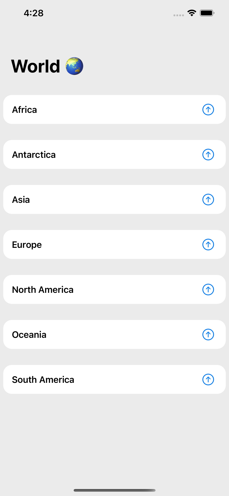

# World 🌏
This application fetches and displays continents and countries.

## Technical Details
- Applied Clean Artchitecture
- Applied MVVM Design Pattern
- Implemented Coordinator to coordinate the application flow
- Used Dependency Injection Container to manage dependencies
- Used grapQL using Apollo framework to fetch data from api (https://countries.trevorblades.com/)
- Written some Unit Tests covering ViewModels
- Used RxSwift for ViewModel bindings
- Used Diffable Data Source to provide data source for UITableView
- Supporting both Dark and Light modes
- Used Swift Package Manager for third party frameworks
- 

